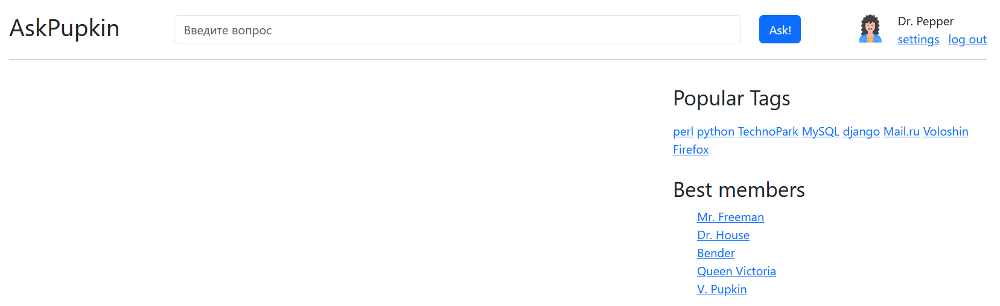
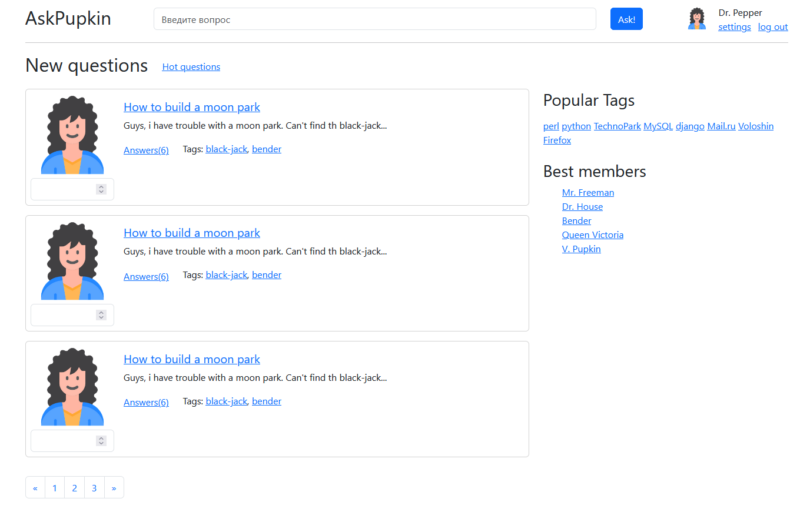
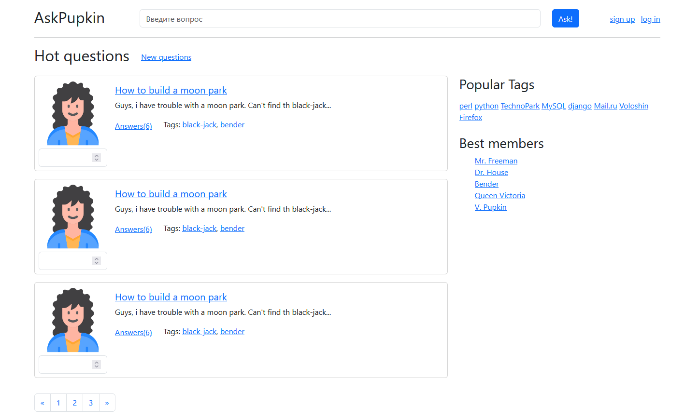
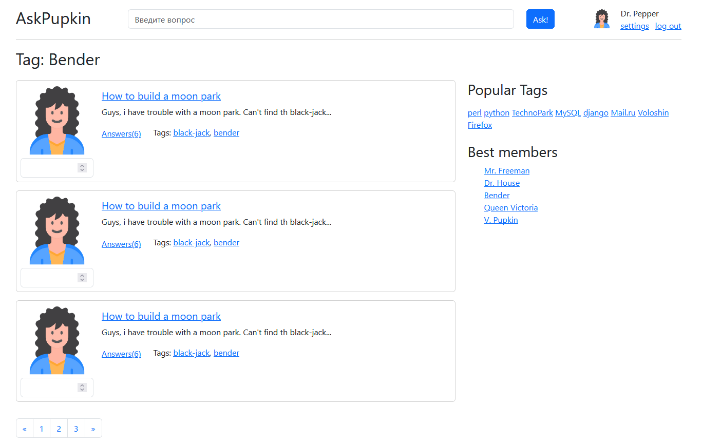
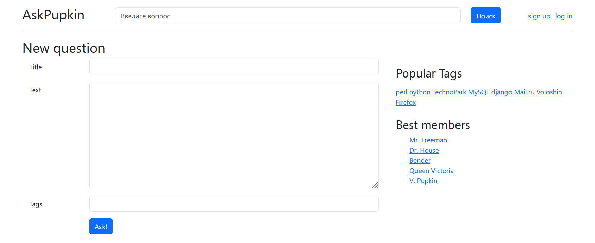
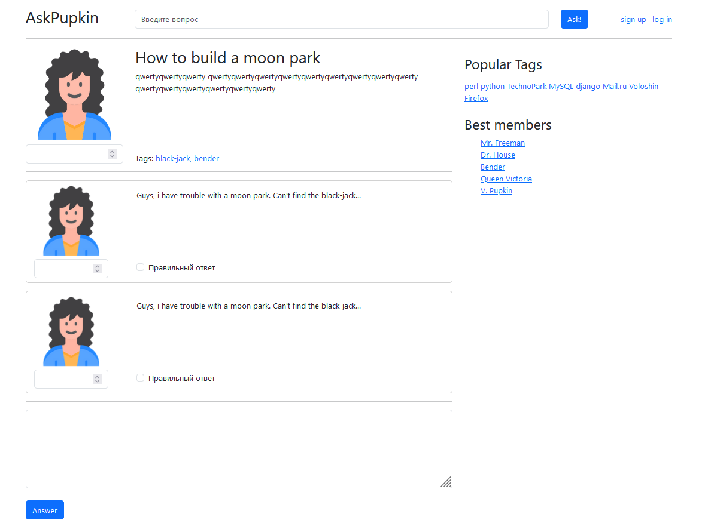
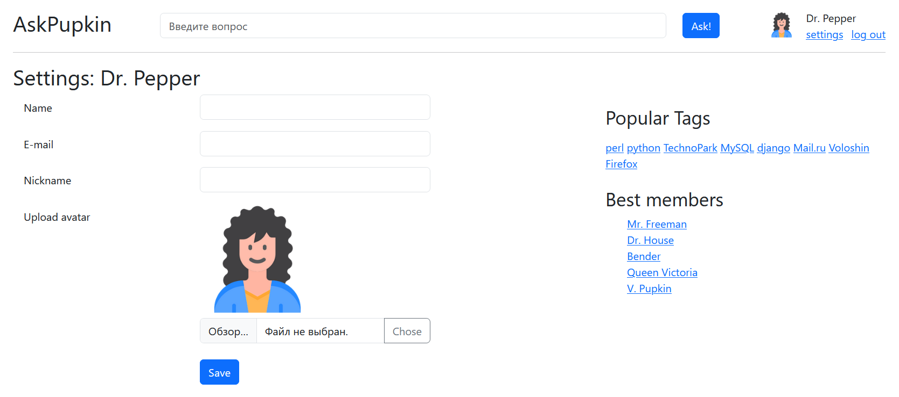
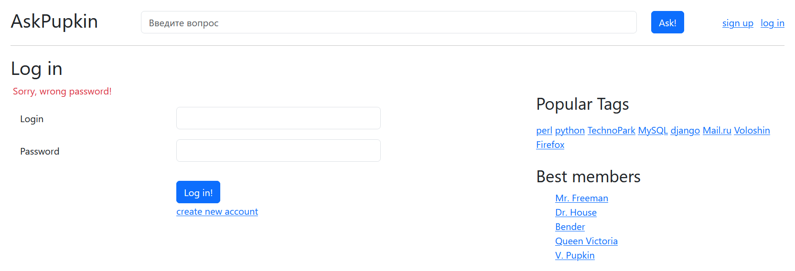
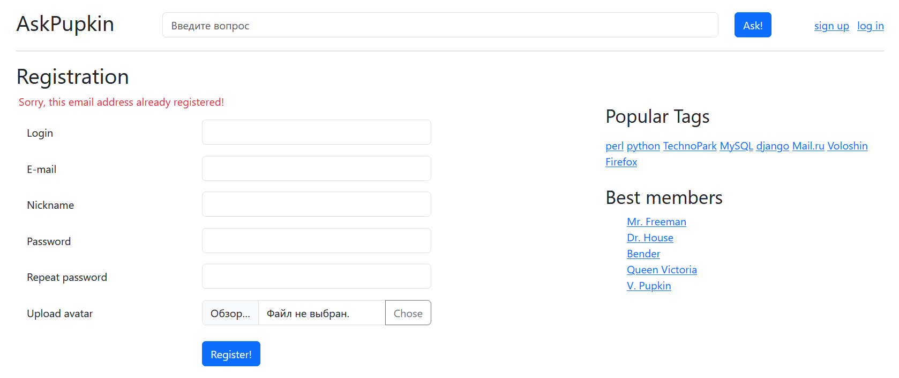

# Домашнее задание 1

## Верстка статического сайта
Целью домашнего задания является подготовка статический верстки сайта (так называемой «рыбы»). Верстку можно размещать в обычных html файлах, в директории public. Также возможно сразу размещать верстку в шаблонах Django. Во втором случае понадобится создать примитивные view и роутинг в urls.py самостоятельно. Подробнее работа с роутингом и шаблонизацей обсуждается в ДЗ2.

### Файлы проекта
- **base.html** основная верстка любой страницы.
- **questions.html** верстка страницы списка вопросов.
- **question_card.html** верстка карточки вопроса. 
- **question.html** верстка страницы вопроса с ответами.
- **answer_card.html** верстка карточки ответа.
- **ask.html** верстка страницы добавления вопроса.
- **login.html** верстка страницы логина.
- **registration.html** верстка страницы регистрации.

### Внешний вид страниц

#### 6.1 Общий вид страницы

  

  Верстка общего вида (layout) страницы - 4 балла:

- общий вид: 2 колонки, header, footer - 1;
- правая колонка - 1;
- блок авторизованного юзера - 1;
- поисковая строка и логотип - 1.

#### 6.2. Страница листинга вопросов

  
  
  

Верстка листинга вопросов - 3 балла:

- общий вид (паддинги, аватарка) - 1;
- кнопки лайков - 1;
- теги, счетчики ответов, остальное - 1.

#### 6.3. Страница добавления вопроса

  

Верстка формы добавления вопроса - 3 балла:

- общий вид - 2;
- сообщения об ошибках - 1.

#### 6.4. Страница одного вопроса

  

Верстка страницы вопроса - 3 балла:

- общий вид - 1;
- чекбокс “правильный ответ”, кнопки лайков - 1;
- форма ответа - 1.

#### 6.5. Страница пользователя с настройками

  

#### 6.6. Формы авторизации и регистрации

  
  

  Верстка форм логина и регистрации - 3 балла:

- общий вид - 2;
- аватарка и сообщения об ошибках - 1.

#### Максимальные баллы за ДЗ - 16 баллов